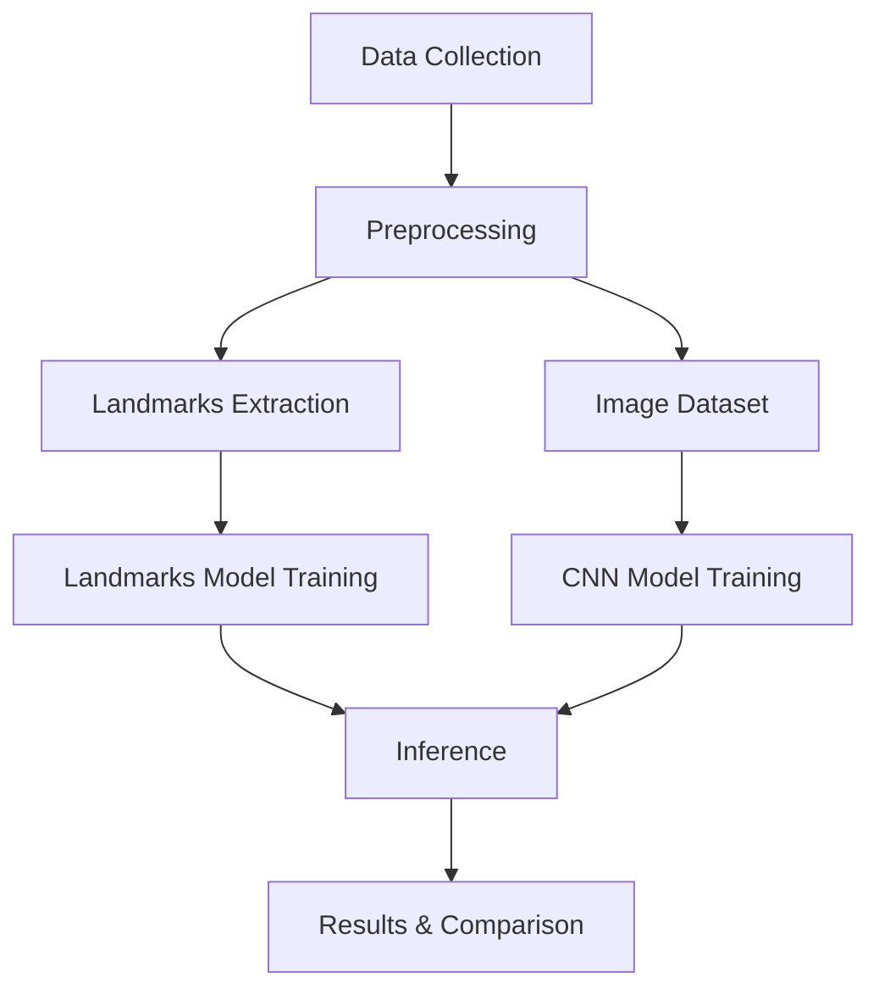

# ASL Hand Sign Detection - Learning Project

## Project Overview

**ASL Hand Sign Detection** is an end-to-end computer vision learning project focused on detecting American Sign Language (ASL) signs **A**, **B**, and **C**. The repository provides tools for custom data collection, preprocessing (including MediaPipe landmark extraction), training two model approaches (landmark-based and CNN), and running real-time inference from a webcam.

**Purpose:** Bridge the gap between ML theory and practical implementation by building a full pipeline: data collection → preprocessing → training → inference → evaluation.

**Learning objectives:**
- Custom data collection and dataset curation
- Feature engineering with MediaPipe landmarks vs end-to-end CNNs
- Model evaluation and comparison (accuracy, confusion matricies, FPS)
- Real-time inference and performance tuning

---

## Project Architecture

Two complementary approaches are supported:

- **Landmarks-based**: Use MediaPipe to extract hand landmarks and train a feedforward neural network on those features.
- **CNN-based**: Train a convolutional neural network directly on images.

Key technologies: OpenCV, MediaPipe, TensorFlow/Keras, Python 3.8+.



---

## Directory Structure

```
HandSignDetection/
├── src/
│   ├── __init__.py
│   ├── collect_data.py
│   ├── preprocess_data.py (TBD)
│   ├── train_landmarks.py (TBD)
│   ├── train_cnn.py (TBD)
│   └── utils/
│       ├── __init__.py
│       ├── config.py
│       ├── logger.py
│       ├── data.py
│       ├── mediapipe_utils.py
│       ├── metrics.py
│       └── visualization.py
├── config/
│   └── config.yaml
├── data/
│   ├── raw/
│   ├── processed/
│   └── landmarks/
├── models/
│   ├── landmarks/
│   └── cnn/
├── logs/
├── results/
├── README.md
├── requirements.txt
└── LICENSE
```

- `src/`: Source code and scripts
- `config/`: YAML configuration files
- `data/raw/`: Collected images arranged by sign label
- `data/processed/`: Validated and split datasets
- `data/landmarks/`: MediaPipe landmark arrays
- `models/`: Trained models (timestamped)
- `logs/`: Runtime logs
- `results/`: Evaluation reports and visualizations

---

## Setup Instructions

**Prerequisites:** Python 3.8+, webcam for data collection.

**Installation:**
1. Create and activate a virtual environment:

   macOS/Linux:
   ```bash
   python -m venv venv
   source venv/bin/activate
   ```

   Windows:
   ```powershell
   python -m venv venv
   venv\Scripts\activate
   ```

2. Install dependencies:
```bash
pip install -r requirements.txt
```

3. Verify installation by importing core packages (OpenCV, MediaPipe, TensorFlow).

**Auto-create directories:** Running any script that calls `create_directories()` from `src.utils.config` will create required folders automatically.

---

## Usage Guidelines

### 1) Data Collection — `src/collect_data.py`
- Purpose: Capture hand sign images via webcam.
- Usage: Run the script, press `A`, `B`, or `C` keys to save frames for the respective sign. Press `q` to quit.
- Output: Files saved to `data/raw/{sign}/`.

Collect 100–200 varied images per sign (different lighting, backgrounds, hand poses).

### 2) Preprocessing — `src/preprocess_data.py` (TBD)
- Purpose: Validate images, extract landmarks, and create train/val/test splits.

### 3) Model Training
- `src/train_landmarks.py` (TBD): Train a FFN on landmark features.
- `src/train_cnn.py` (TBD): Train a CNN on images.

Models are saved under `models/{landmarks,cnn}/` with timestamps and metrics.

### 4) Inference
- `src/inference_landmarks.py` and `src/inference_cnn.py` (TBD)
- Run to perform real-time predictions on webcam feed. Press `q` to quit.

### 5) Model Comparison — `src/compare_models.py` (TBD)
- Compares accuracy, speed, and confusion matrices. Outputs reports to `results/`.

---

## Configuration

All runtime parameters (paths, hyperparameters, thresholds) are centralized in `config/config.yaml`. Modify this file to change behavior without editing code.

---

## Logging

Use the centralized logger:

```python
from src.utils.logger import setup_logger
logger = setup_logger(__name__)
logger.info("Starting data collection...")
```

Log files are written to `logs/` with a timestamped filename.

---

## Troubleshooting

- **Webcam not detected:** Check permissions, try different camera index.
- **MediaPipe failures:** Improve lighting, adjust `min_detection_confidence` in the config.
- **Slow inference:** Lower resolution or use the landmarks-based model.
- **Imports failing:** Ensure virtualenv is activated and dependencies are installed.

---

## Future Work

- Expand supported signs (D–Z)
- Add more robust preprocessing and augmentation
- Evaluate MobileNet/ResNet architectures
- Package the project for deployment (CLI, web, or mobile)

---

## License & Acknowledgments

See `LICENSE` for licensing details. Acknowledge MediaPipe, TensorFlow, and OpenCV projects.
